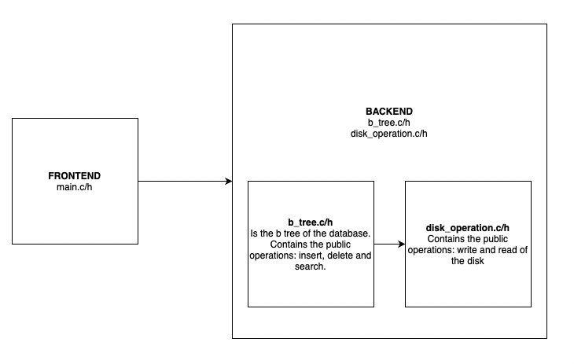

# A simple experimental database

> Nothing in the world can take the place of persistence. - Calvin Coolidge

## Architecture
    <br><br>
   The frontend layer only have things that client view. <br>
   The backend layer have all neccessary processing to a storage data (disk operation, btree...).  <br>

## Tests
   In End To End tests is required rspec<br>
   `bundle exec rspec`<br>

## Contributions
   Just fork the project and open a PR. It can be directly to the the master

   **Code style** <br>
   All header files must start with the lines `#ifndef _HEADER_FILE_` and `#define _HEADER_FILE_` to avoid multiple imports.<br>
   All variable and functions must contain small latters and words separated with _ (underline).<br>

   I understand that in your web project you use words separated by capital letters, however, in C all commands are in snake_case, which itself is a good reason to separate words with _ (underline). Furthermore, which of the two strings below do you find more comfortable to read?
   ```
   IHadAGreenDollWithALargeTShirt
   
   i_had_a_green_doll_with_a_large_t_shirt  

   ```

   The ifs must contain spacing between operations: `a != b`, but not after parentheses: `ìf(a != b)`.<br>
   The keys must be declared in the same line as the function: `void function() {` and must contain spaces after the parentheses.<br>
   The identation must have 4 spaces,c onfigure this in your code editor. <br>
   All constants must be declared with capital latters and separated by _ : `#define CONS_EXAMPLE 10`
